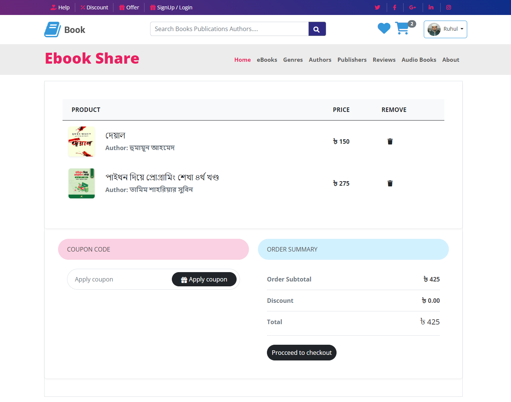
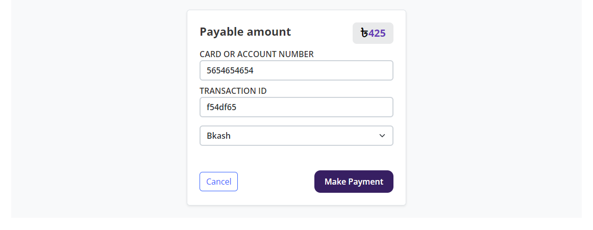
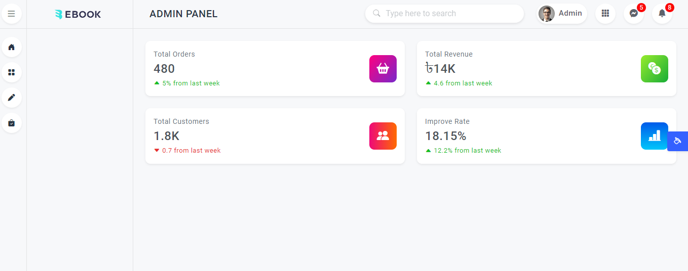
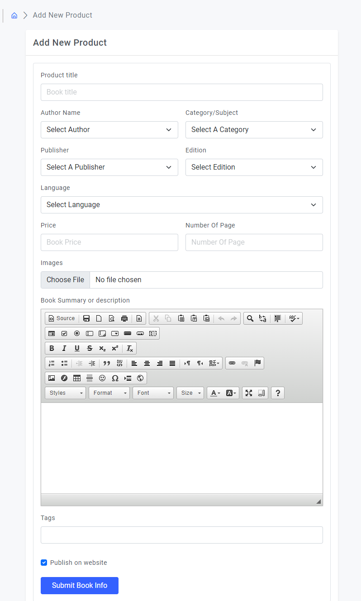
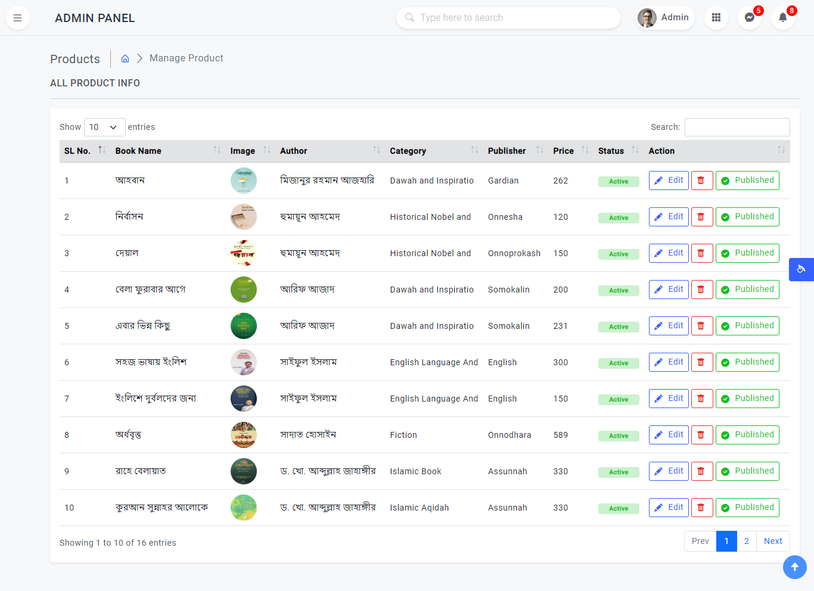
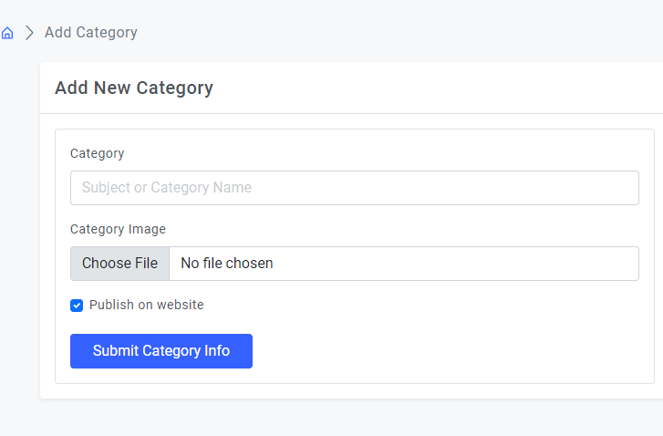
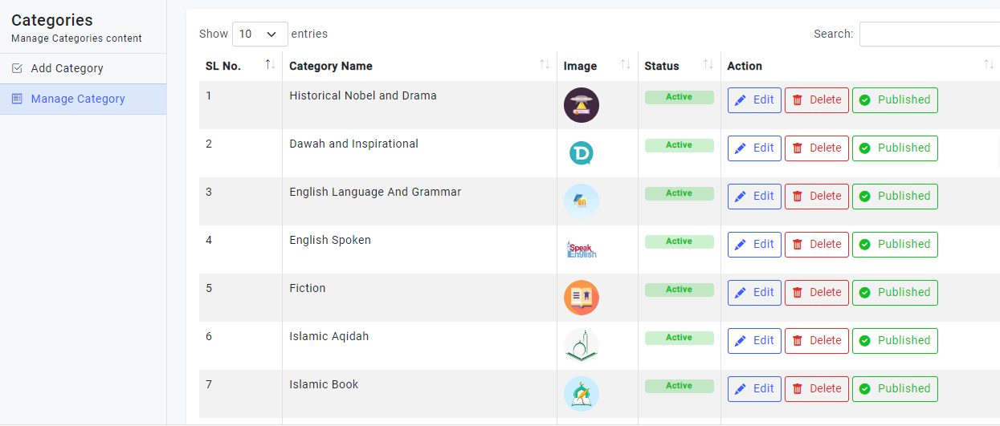
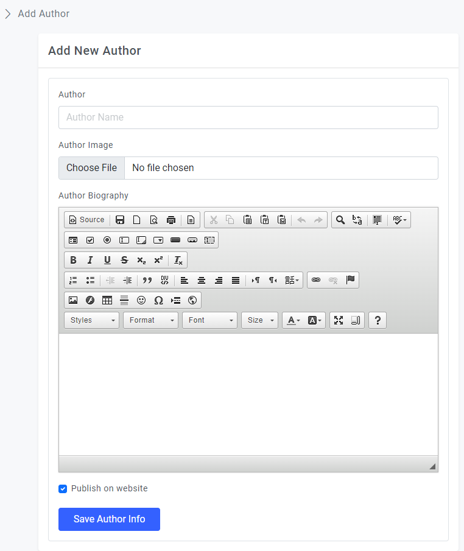
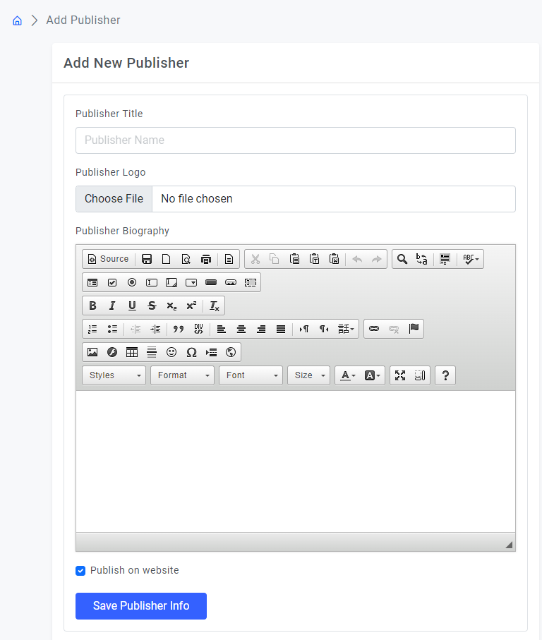

## EbookShare - Ebook Ecommerce System
<blockquote>
This is a simple web-based open source software written in PHP, JavaScript. This was specifically written for ebook buying, selling, sharing and reviewing system.
</blockquote>

## Features of EbookShare 
<ul>
    <li>Login System</li>
    <li>Registraion System</li>
    <li>User Profile</li>
    <li>Cart Management</li>
    <li>Checkout</li>
    <li>Manage User</li>
    <li>Add Book</li>
    <li>Manage Book</li>
    <li>Add Category</li>
    <li>Manage Category</li> 
    <li>Add Author</li>
    <li>Manage Author</li>
</ul>

## Technology
<ul>
    <li>PHP</li>
    <li>Laravel</li>
    <li>MySQL</li>
    <li>JavaScript</li>
    <li>HTML</li>
    <li>CSS</li>
    <li>Bootstrap</li>
</ul>

## ScreenShot of this project
## Category of Book Page
<table>
    <thead>
        <tr>
            <th>
                
            </th>
        </tr>
    </thead>
</table>

## Author of Book Page
<table>
    <thead>
        <tr>
            <th>
                
            </th>
        </tr>
    </thead>
</table>

## Publisher of Book Page
<table>
    <thead>
        <tr>
            <th>
                
            </th>
        </tr>
    </thead>
</table>

## Login Page
<table>
    <thead>
        <tr>
            <th>
                
            </th>
        </tr>
    </thead>
</table>

## Registration Page
<table>
    <thead>
        <tr>
            <th>
                
            </th>
        </tr>
    </thead>
</table>

## Manage Cart
<table>
    <thead>
        <tr>
            <th>
                
            </th>
        </tr>
    </thead>
</table>

## Checkout with Payment
<table>
    <thead>
        <tr>
            <th>
                
            </th>
        </tr>
    </thead>
</table>

## User Profile Page
<table>
    <thead>
        <tr>
            <th>
                
            </th>
        </tr>
    </thead>
</table>

## Admin Dashboard
<table>
    <thead>
        <tr>
            <th>
                
            </th>
        </tr>
    </thead>
</table>

## Add Book 
<table>
    <thead>
        <tr>
            <th>
                
            </th>
        </tr>
    </thead>
</table>

## Manage Book
<table>
    <thead>
        <tr>
            <th>
                
            </th>
        </tr>
    </thead>
</table>

## Add Category of Book
<table>
    <thead>
        <tr>
            <th>
                
            </th>
        </tr>
    </thead>
</table>

## Manage Category
<table>
    <thead>
        <tr>
            <th>
                
            </th>
        </tr>
    </thead>
</table>

## Add Author
<table>
    <thead>
        <tr>
            <th>
                
            </th>
        </tr>
    </thead>
</table>

## Add Publisher
<table>
    <thead>
        <tr>
            <th>
                
            </th>
        </tr>
    </thead>
</table>

## Home Page
<table>
    <thead>
        <tr>
            <th>
                
            </th>
        </tr>
    </thead>
</table>